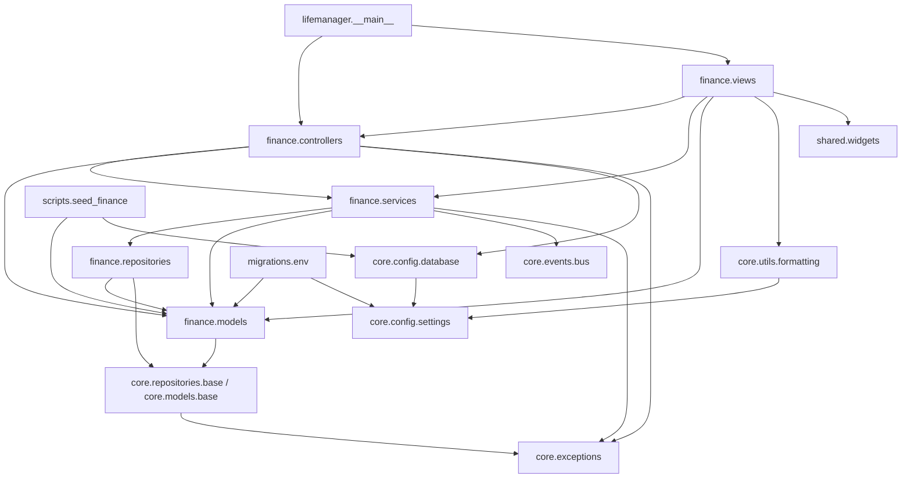

# Audit de l'existant — préparation refactor hexagonal

> Audit factuel du codebase au 2026-09-10. Aucun refactor proposé ici, seulement
> l'état des lieux. Les numéros de ligne cités correspondent à l'état actuel des
> fichiers.

---

## 1. Inventaire des modules

| Module | Responsabilité déclarée | Responsabilité réelle | LOC approx. |
|---|---|---|---|
| `lifemanager/__main__.py` | Point d'entrée applicatif | Crée la `QApplication`, instancie `FinanceController` + `TransactionsView` dans une `QMainWindow` — fait aussi office de composition root | 27 |
| `core/config/settings.py` | Configuration applicative (singleton) | Charge `.env`, expose `settings` (dataclass frozen) : DB, app, API OFF | 49 |
| `core/config/database.py` | Gestion engine/session SQLAlchemy | Crée l'engine **à l'import du module**, expose `get_session()` (context manager qui commit/rollback) | 44 |
| `core/events/bus.py` | Bus d'événements in-process | Singleton synchrone `bus` + constantes `Events`. **Aucun abonné en production** (seuls les tests appellent `bus.on`) | 46 |
| `core/exceptions/exceptions.py` | Hiérarchie d'exceptions domaine | 6 classes d'exceptions, dont `BudgetExceededError` et `InsufficientFundsError` (jamais levées dans le code actuel) | 29 |
| `core/models/base.py` | Base déclarative SQLAlchemy | `Base` + `BaseModel` (UUID PK, timestamps). Sert d'**entité domaine ET de modèle ORM** pour tout le projet | 38 |
| `core/repositories/base.py` | Repository générique | `BaseRepository[T]` typé sur `BaseModel` (donc sur l'ORM), CRUD de base sur une `Session` injectée | 38 |
| `core/utils/formatting.py` | Formatage localisé (Babel) | `format_amount`, `format_short_date` — dépendent du singleton `settings` | 22 |
| `finance/models/` | Modèles du domaine finance | 8 classes **SQLAlchemy mappées** (Account, Alert, Budget, Category, Debt, SavingsGoal, Transaction) + enums. Contiennent un peu de logique métier (`Transaction.signed_amount`, `Transaction.month`) | ~270 |
| `finance/repositories/` | Accès DB finance | 6 repositories héritant `BaseRepository`. Requêtes d'agrégation SQL spécifiques Postgres (`to_char`, `CASE WHEN`) dans `transaction_repo.py` et `account_repo.py` | ~230 |
| `finance/services/finance_service.py` | Logique métier finance | Orchestre 6 repositories, valide les règles (montant > 0, DETTE→Debt, EPARGNE→Goal), calcule KPIs, émet des événements. Définit les DTOs (`TransactionDTO`, `BudgetCheckResult`, `MonthlyKPIs`) | ~190 |
| `finance/controllers/finance_controller.py` | Pont PyQt ↔ service | `QObject` à signaux. **Ouvre et commit une session SQLAlchemy par appel** (`_run`, Pattern Unit-of-Work). Retourne des entités ORM aux vues | ~110 |
| `finance/views/` | UI finance (3 widgets) | `TransactionsView` (écran principal), `AddTransactionDialog` (formulaire), `TransactionTableModel` (adaptateur Qt qui lit les relations ORM `tx.account.name`) | ~440 |
| `shared/widgets/kpi_tile.py` | Widget réutilisable | Tuile KPI pure présentation, correctement découplée | 31 |
| `grocery/`, `nutrition/`, `dashboard/`, `settings/` | Modules planifiés | **Vides** — uniquement des `__init__.py` vides (0 LOC de code) | 0 |
| `scripts/seed_finance.py` | Données de démo | Insère comptes/catégories/transactions **en contournant le service** (création directe d'ORM + `session.add`) | 160 |
| `migrations/` | Migrations Alembic | `env.py` lit le singleton `settings` et importe `finance.models` pour `Base.metadata`. Une seule migration (schéma initial) | ~160 |
| `tests/unit/finance/` | Tests unitaires finance | 2 fichiers : service (session + repos mockés) et controller (service mocké, signaux Qt via pytest-qt) | ~380 |
| `tests/integration/` | Tests d'intégration | **Vide** (uniquement `__init__.py`) | 0 |

**Constats d'inventaire :**

- Le seul module fonctionnel est **finance**. Grocery, nutrition, dashboard et
  settings sont des coquilles vides.
- Le modèle `Alert` ([alert.py](../lifemanager/finance/models/alert.py)) et les
  événements `GOAL_UPDATED` / `BUDGET_EXCEEDED` n'ont **aucun consommateur** :
  le bus est émetteur-only en production.
- La dépendance `requests` (Open Food Facts) est déclarée dans
  [pyproject.toml](../pyproject.toml) mais **aucun code ne l'utilise**.
- Il existe un artefact de création de dossiers sous Windows :
  `tests/{unit,integration}/` (accolades littérales dans le nom du dossier).
- `lifemanager/__init__/` est un package littéralement nommé `__init__`, vide.

---

## 2. Graphe de dépendances

Lecture : la dépendance la plus chargée est `finance.models` — importée par
**toutes** les couches y compris les vues. `core.models.base` (SQLAlchemy) est
au pied de tout le graphe : aucune couche n'est dépourvue de dépendance
transitive à SQLAlchemy.

---

## 3. Fuites de couches identifiées

**Constat préalable (à créditer à l'existant)** : il n'y a **aucun import
direct** de SQLAlchemy dans les vues, ni de PyQt6 dans les modèles, services ou
repositories. La structure en couches MVC est respectée en surface. Les fuites
sont toutes **structurelles** (types partagés, singletons, cycle de vie), pas
des imports sauvages.

1. **Entité domaine = modèle ORM (fusion domaine/persistance)**
   - [core/models/base.py](../lifemanager/core/models/base.py#L14-L37) : `BaseModel` hérite de `DeclarativeBase`. Toutes les "entités" de [finance/models/](../lifemanager/finance/models/__init__.py) sont des classes mappées SQLAlchemy, avec imports `Mapped`, `mapped_column`, `relationship`, types `UUID` spécifiques Postgres (ex. [transaction.py](../lifemanager/finance/models/transaction.py#L23-L48)).
   - Impact : **fort** — c'est la fuite fondatrice ; en hexagonal il faudra des entités domaine pures + mappers.
   - Correction : introduire des dataclasses domaine distinctes des classes ORM, avec mapping dans la couche infrastructure.

2. **Logique métier sur une classe ORM**
   - [transaction.py](../lifemanager/finance/models/transaction.py#L50-L58) : propriétés `signed_amount` et `month` (règles de signe et de regroupement mensuel) définies sur le modèle SQLAlchemy.
   - Impact : moyen — la logique est petite mais elle est prisonnière de l'ORM.
   - Correction : déplacer ces règles sur l'entité domaine pure ou dans le service.

3. **Le service est typé sur `sqlalchemy.orm.Session`**
   - [finance_service.py](../lifemanager/finance/services/finance_service.py#L13) (import) et [finance_service.py](../lifemanager/finance/services/finance_service.py#L66) (`def __init__(self, session: Session)`).
   - Impact : **fort** — impossible d'instancier `FinanceService` sans SQLAlchemy ; les tests actuels contournent via `MagicMock` ([test_finance_service.py](../tests/unit/finance/test_finance_service.py#L28-L38)).
   - Correction : le service ne devrait dépendre que de ports (interfaces de repositories), pas de `Session`.

4. **Instanciation de repositories concrets dans le service**
   - [finance_service.py](../lifemanager/finance/services/finance_service.py#L67-L73) : le constructeur new-up les 6 repositories.
   - Impact : **fort** — pas d'injection de dépendances, pas de ports ; le service connaît l'implémentation.
   - Correction : injecter les repositories (ou leurs abstractions) au constructeur.

5. **Cycle de vie de la session dans le contrôleur Qt**
   - [finance_controller.py](../lifemanager/finance/controllers/finance_controller.py#L122-L139) : `_run` ouvre `get_session()`, commit implicite en fin de bloc, rollback sur exception — l'Unit-of-Work vit dans un `QObject`.
   - Impact : **fort** — la frontière transactionnelle est décidée par la couche présentation.
   - Correction : déplacer l'Unit-of-Work dans la couche application (interacteurs/use-cases).

6. **Entités ORM livrées aux vues PyQt**
   - Le contrôleur retourne `list[Transaction]`, `list[Account]`, etc. ([finance_controller.py](../lifemanager/finance/controllers/finance_controller.py#L75-L96)) ; le table model lit les relations ORM `tx.account.name` / `tx.category.name` dans `data()` ([transaction_table_model.py](../lifemanager/finance/views/transaction_table_model.py#L55-L74)) ; la vue confirme une suppression via `tx.label` / `tx.amount` ([transactions_view.py](../lifemanager/finance/views/transactions_view.py#L197-L213)) ; le dialogue lit `account.id` / `account.name` ([add_transaction_dialog.py](../lifemanager/finance/views/add_transaction_dialog.py#L117-L130)).
   - Impact : **fort** — les vues dépendent du schéma ORM ; la config `expire_on_commit=False` de [database.py](../lifemanager/core/config/database.py#L34) et le `joinedload` de [transaction_repo.py](../lifemanager/finance/repositories/transaction_repo.py#L33-L49) ne sont que des béquilles contre les `DetachedInstanceError` / N+1 créés par ce couplage.
   - Correction : faire transiter des DTOs de lecture (view models) entre application et UI.

7. **Règles métier dupliquées dans l'UI**
   - [add_transaction_dialog.py](../lifemanager/finance/views/add_transaction_dialog.py#L148-L158) : le sens par défaut (`REVENU → ENTREE`, sinon `SORTIE`) et l'obligation dette/objectif selon `FlowType` sont codés dans le dialogue, en double de `_validate_transaction` du service ([finance_service.py](../lifemanager/finance/services/finance_service.py#L204-L217)).
   - Impact : moyen — duplication de règles ; si la règle change, deux endroits à modifier.
   - Correction : la règle vit dans le domaine ; l'UI ne fait que refléter un état fourni par l'application.

8. **Singleton bus global appelé depuis la logique métier**
   - [finance_service.py](../lifemanager/finance/services/finance_service.py#L16) importe le singleton `bus` ; appels synchrones aux lignes 112, 114, 119, 197.
   - Impact : moyen — dépendance cachée, non injectée, difficile à substituer en test ; de plus le bus n'a actuellement aucun abonné en production (code mort de fait).
   - Correction : injecter un port `EventPublisher` dans le service.

9. **Engine SQLAlchemy créé à l'import du module**
   - [database.py](../lifemanager/core/config/database.py#L20-L27) : `_engine = create_engine(...)` au top-level — tout import de `core.config.database` (y compris depuis un test) instancie un engine Postgres.
   - Impact : moyen — effet de bord à l'import, gêne les tests et le découplage.
   - Correction : initialisation paresseuse (factory) pilotée par la composition root.

10. **Composition root fusionnée avec le widget principal**
    - [__main__.py](../lifemanager/__main__.py#L17-L24) : `MainWindow` instancie le contrôleur et la vue — aucun point d'assemblage distinct de l'UI.
    - Impact : faible — facile à extraire, mais bloque l'inversion de dépendances au démarrage.
    - Correction : une fonction `bootstrap()` assemble les dépendances et les passe à l'UI.

11. **Outils hors-app couplés au singleton settings**
    - [migrations/env.py](../migrations/env.py#L10-L24) (Alembic lit `.env` via `settings`) et [formatting.py](../lifemanager/core/utils/formatting.py#L11-L23) (formatage UI dépend du singleton global).
    - Impact : faible — pragmatique pour un outillage, mais à connaître si la config devient injectée.
    - Correction : passer la config explicitement aux points d'entrée outillage.

12. **Le seed contourne la couche service**
    - [seed_finance.py](../scripts/seed_finance.py#L131-L160) : création directe d'objets ORM + `session.add`, sans passer par `FinanceService` — les règles métier ne sont ni exercées ni garanties pour les données seedées.
    - Impact : faible — script utilitaire, mais symptôme que la validation n'est applicable que par un seul chemin.
    - Correction : faire passer le seed par les use-cases applicatifs.

13. **Les vues importent le module service pour ses DTOs**
    - [transactions_view.py](../lifemanager/finance/views/transactions_view.py#L32) (`MonthlyKPIs`) et [add_transaction_dialog.py](../lifemanager/finance/views/add_transaction_dialog.py#L33) (`TransactionDTO`) importent depuis `finance.services.finance_service`.
    - Impact : faible — les DTOs sont propres, mais ils sont logés dans le module d'implémentation du service.
    - Correction : déplacer les DTOs dans un module de contrats applicatifs partagé.

---

## 4. Couverture de tests

**Ce qui est testé (2 fichiers, ~380 LOC, tout unitaire) :**

- [test_finance_service.py](../tests/unit/finance/test_finance_service.py) : validation des règles (montant, libellé, DETTE/EPARGNE ↔ debt_id/goal_id), `create_transaction` (persistance + événements + budget check), `delete_transaction`, `check_budget`. Repos et session entièrement mockés.
- [test_finance_controller.py](../tests/unit/finance/test_finance_controller.py) : traduction exceptions domaine → signal `error`, émission des signaux Qt, non-propagation des `LifeManagerError` vs propagation des exceptions inattendues. Service mocké, `get_session` patché.

**Ce qui n'est pas testé :**

- **Tous les repositories** — en particulier le SQL spécifique Postgres : `func.to_char(Transaction.date, "YYYY-MM")` ([transaction_repo.py](../lifemanager/finance/repositories/transaction_repo.py#L27)), l'agrégation `CASE WHEN` du solde ([account_repo.py](../lifemanager/finance/repositories/account_repo.py#L21-L29)), la sémantique signée/non-signée documentée des `total_*`.
- **Les modèles** : `signed_amount`, `month`, la profondeur ≤ 2 des catégories (règle non testée et non implémentée côté code).
- **Les vues et le table model** (pytest-qt est installé mais aucun test de vue n'existe).
- **Le bus d'événements**, `formatting.py`, `get_session` (commit/rollback), la migration Alembic initiale.
- `update_debt_balance` et `get_monthly_kpis` (partiellement couverts côté controller, non vérifiés sur les valeurs côté service).
- Le répertoire [tests/integration/](../tests/integration/) est vide.

**Dette de test critique pour un refactor sûr :** la sémantique d'agrégation
financière (totaux par mois/flow/sense, cashflow, solde de compte) est le
comportement le plus précieux et le moins couvert — elle ne peut être validée
que contre une vraie base Postgres. Sans tests d'intégration de repositories,
l'extraction des entités domaine et le remplacement du mapping ORM se feront
sans filet sur exactement la partie la plus risquée.

---

## 5. Points de couplage fort

1. **Fusion entité domaine / modèle ORM** (`core.models.base.BaseModel` +
   `finance.models.*`). Tout le graphe de dépendances converge sur des classes
   SQLAlchemy mappées ; c'est le nœud qui rend toute extraction de domaine
   impossible sans casser simultanément repositories, services, contrôleurs
   et vues.

2. **Session comme fil conducteur transverse.** La `Session` SQLAlchemy est
   créée par le contrôleur Qt ([finance_controller.py](../lifemanager/finance/controllers/finance_controller.py#L132)),
   injectée dans le service, transmise aux 6 repositories, et commitée par le
   context manager de [database.py](../lifemanager/core/config/database.py#L37-L44).
   Le type `Session` apparaît dans la signature publique du service : la couche
   "métier" est nominativement dépendante de l'infrastructure.

3. **Entités ORM traversant la frontière UI.** Le table model lit des
   relations lazy (`tx.account.name`) dans `data()` — appelé potentiellement
   des centaines de fois par repaint. Toute la chaîne `joinedload` +
   `expire_on_commit=False` existe uniquement pour rendre ce couplage
   survivable ; le découpler demandera de réécrire le contrat contrôleur↔vue.

4. **Constructeur de service auto-câblé.** `FinanceService.__init__`
   instancie ses 6 repositories concrets — il n'existe aucun point où
   substituer une implémentation (in-memory, fake) sans monkeypatching, comme
   le montrent les tests qui réassignent `svc._tx_repo` après construction
   ([test_finance_service.py](../tests/unit/finance/test_finance_service.py#L31-L35)).

5. **Singletons globaux à effets de bord** : `settings` (lecture `.env` à
   l'import), `_engine` (connexion configurée à l'import), `bus` (émission
   synchrone depuis le service). Trois dépendances cachées que ni les
   signatures ni les constructeurs ne révèlent.

---

## 6. Recommandations pour l'ordre du refactor

1. **Combler d'abord la dette de test d'intégration sur les repositories
   finance** (base `lifemanager_test`). C'est le seul filet possible avant de
   toucher au modèle de données, et il verrouille la sémantique d'agrégation
   documentée mais jamais vérifiée.
2. **Extraire le domaine finance** (entités pures + règles de validation
   actuellement dans `_validate_transaction` + propriétés `signed_amount` /
   `month`). Finance est le seul module avec de la logique réelle et des tests
   existants comme harnais ; les autres modules sont vides.
3. **Définir les ports de persistence et ré-écrire les repositories comme
   adapters** des ports, en déplaçant les DTOs hors du module service. Le
   service est petit (~190 LOC) et déjà proche du bon rôle.
4. **Sortir l'Unit-of-Work du contrôleur Qt** vers la couche application, puis
   remplacer le singleton `bus` par un port injecté.
5. **Découpler l'UI des entités ORM** (DTOs de lecture côté contrôleur) — à
   faire après les étapes 2-4 car toutes les signatures en dépendent.
6. **Grocery / nutrition / dashboard : ne pas "refactorer"** — ils sont vides ;
   les démarrer directement dans l'architecture cible, ce qui servira de
   validation de l'architecture sur un module neuf.

---

## Questions ouvertes

- **`Alert`** ([alert.py](../lifemanager/finance/models/alert.py)) : table créée
  par la migration initiale, aucun repository, aucun usage — modèle prématuré à
  conserver ou à retirer ?
- **`BudgetExceededError` et `InsufficientFundsError`** : définies mais jamais
  levées ; le dépassement de budget émet un événement sans consommateur. Quel
  comportement produit est réellement voulu (bloquant ou informatif) ?
- **Règle "catégorie profondeur ≤ 2"** : documentée dans CLAUDE.md mais rien ne
  l'applique dans le code — à implémenter où ?
- **Event bus sans abonnés** : le dashboard (futur consommateur) n'existe pas ;
  faut-il garder le bus pour le refactor ou le réintroduire plus tard ?
- **`tests/{unit,integration}/`** (accolades littérales) et
  **`lifemanager/__init__/`** : artefacts à supprimer ?
- **`requests` / Open Food Facts** : dépendance et settings (`ApiSettings`)
  déclarées sans aucun code — anticiper un port HTTP maintenant ou attendre le
  module nutrition ?
