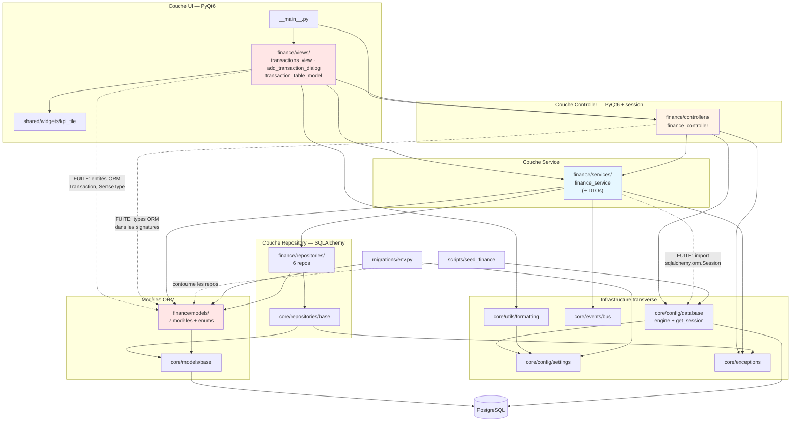

# Audit de l'existant — LifeManager

> **Date de l'audit :** 2026-09-10
> **Périmètre :** l'intégralité du package `lifemanager/`, plus `migrations/`, `scripts/`, `tests/`
> **Objet :** état factuel du code en vue d'un refactor vers une architecture hexagonale (Ports & Adapters)
> **Hors périmètre :** proposition d'architecture cible, plan d'implémentation, code

---

## 0. Note liminaire sur le postulat de départ

La demande décrivait un « POC monolithique, logique métier et infra probablement mélangées »
autour de todos / habits / notes. **Ce n'est pas ce que contient le dépôt.**

Constats factuels :

- Le domaine réel est **finances personnelles** (transactions, comptes, catégories, budgets,
  dettes, objectifs d'épargne). Il n'existe aucune trace de todos, habits ou notes dans le code
  (`grep` sur l'ensemble du package : aucune occurrence).
- Le code n'est **pas monolithique** : il applique déjà une séparation en 5 couches
  (View → Controller → Service → Repository → DB) documentée dans [CLAUDE.md](../CLAUDE.md)
  et dans [docs/cahier_specification_existant.md](cahier_specification_existant.md).
- Un audit antérieur existe déjà : [docs/cahier_specification_existant.md](cahier_specification_existant.md)
  (v1, état au 2026-05-08, 20 Ko). Le présent document ne le remplace pas ; il l'aborde sous
  l'angle spécifique des fuites de couches et de la faisabilité du refactor hexagonal.

Le reste de ce document décrit ce qui est **réellement** dans le dépôt.

**Volumétrie :** 2 870 LOC Python au total hors `venv/`, dont **1 014 statements** mesurés par
l'outil de couverture. Le module Finance représente à lui seul la quasi-totalité du code métier.

---

## 1. Inventaire des modules

### 1.1 Modules implémentés

| Module | Responsabilité déclarée | Responsabilité réelle | LOC |
|---|---|---|---|
| [core/config/](../lifemanager/core/config/) | Settings + session factory | Conforme. `settings.py` : singleton gelé lu depuis `.env`. `database.py` : engine + `get_session()` contextmanager. **L'engine est créé à l'import du module** ([database.py:22](../lifemanager/core/config/database.py#L22)) | 119 |
| [core/models/base.py](../lifemanager/core/models/base.py) | `BaseModel` (UUID + timestamps) | Conforme, mais c'est une **base SQLAlchemy déclarative**, pas une base d'entité métier. Tout « modèle de domaine » du projet est donc par construction un objet ORM | 46 |
| [core/repositories/base.py](../lifemanager/core/repositories/base.py) | CRUD générique `BaseRepository[T]` | Conforme. `add` / `delete` / `get_by_id` / `find_by_id` / `list_all`, typé `T bound=BaseModel` (donc borné à l'ORM) | 54 |
| [core/events/bus.py](../lifemanager/core/events/bus.py) | Bus d'événements in-process | Conforme, mais **singleton module-level global** ([bus.py:41](../lifemanager/core/events/bus.py#L41)), sans injection possible. Aucun abonné n'est enregistré dans le code applicatif : le bus n'est utilisé qu'en émission | 61 |
| [core/exceptions/](../lifemanager/core/exceptions/) | Hiérarchie d'exceptions domaine | Conforme. `LifeManagerError` racine + 6 sous-types. `BudgetExceededError` porte un message formaté en euros ([exceptions.py:31](../lifemanager/core/exceptions/exceptions.py#L31)) — présentation dans le noyau | 43 |
| [core/utils/formatting.py](../lifemanager/core/utils/formatting.py) | Formatage locale | Conforme : helpers Babel. Dépend du singleton `settings` ([formatting.py:10](../lifemanager/core/utils/formatting.py#L10)). Utilisé uniquement par la couche vue | 30 |
| [finance/models/](../lifemanager/finance/models/) | Modèles domaine finance | **Modèles ORM SQLAlchemy**, pas des entités métier. 7 tables + `enums.py`. Contiennent quelques règles métier sous forme de `@property` (voir §3.2) | 322 |
| [finance/repositories/](../lifemanager/finance/repositories/) | Accès DB | Conforme. 6 repos. `transaction_repo.py` porte la logique d'agrégation (SQL `to_char`, `coalesce/sum`) ; `account_repo.py` calcule le solde en SQL via `CASE WHEN` | 269 |
| [finance/services/finance_service.py](../lifemanager/finance/services/finance_service.py) | Logique métier pure | **Quasi conforme, avec une réserve majeure** : la signature du constructeur est `__init__(self, session: Session)` ([finance_service.py:82](../lifemanager/finance/services/finance_service.py#L82)) et le module importe `sqlalchemy.orm.Session` ([:14](../lifemanager/finance/services/finance_service.py#L14)). Les repos sont instanciés en dur, pas injectés | 213 |
| [finance/controllers/finance_controller.py](../lifemanager/finance/controllers/finance_controller.py) | Pont vue ↔ service | Conforme au pattern déclaré. `QObject` + 6 `pyqtSignal`. Ouvre une session par appel public via `_run()` ([:122-139](../lifemanager/finance/controllers/finance_controller.py#L122-L139)). C'est aussi **le seul point de composition** de l'application | 139 |
| [finance/views/](../lifemanager/finance/views/) | Widgets PyQt6 | Conforme au rôle UI, mais **manipule directement des entités ORM** (voir §3.3). 3 fichiers : vue principale, dialogue de saisie, table model | 545 |
| [shared/widgets/kpi_tile.py](../lifemanager/shared/widgets/kpi_tile.py) | Widget réutilisable | Conforme. Widget pur, aucune dépendance métier | 40 |
| [__main__.py](../lifemanager/__main__.py) | Point d'entrée | Conforme. Instancie `QApplication`, `FinanceController`, `TransactionsView` | 39 |
| [migrations/](../migrations/) | Alembic | Conforme. `env.py` importe `lifemanager.finance.models` pour peupler `Base.metadata` ([env.py:14](../migrations/env.py#L14)). 1 migration : `20019311ac90_initial_schema.py` | 181 |
| [scripts/seed_finance.py](../scripts/seed_finance.py) | Jeu de données de démo | Conforme au besoin, mais **contourne la couche repository** : `select()` et `session.scalar()` en direct ([seed_finance.py:34-36](../scripts/seed_finance.py#L34-L36)) | 180 |
| [tests/unit/finance/](../tests/unit/finance/) | Tests unitaires | 2 fichiers, 31 tests, tous verts | 507 |

### 1.2 Modules déclarés mais vides

Vérifié par `find … -size +0c` : **aucun fichier non vide** dans ces arborescences.

| Module | État réel |
|---|---|
| [grocery/](../lifemanager/grocery/) | 6 `__init__.py` vides (models, repositories, services, controllers, views). Aucun code |
| [nutrition/](../lifemanager/nutrition/) | Idem — 6 `__init__.py` vides. Aucun code, malgré la dépendance `requests` déclarée dans [pyproject.toml](../pyproject.toml) et la config `ApiSettings.off_base_url` ([settings.py:46](../lifemanager/core/config/settings.py#L46)) |
| [dashboard/](../lifemanager/dashboard/) | 3 `__init__.py` vides |
| [settings/](../lifemanager/settings/) | 3 `__init__.py` vides |
| [assets/](../assets/) | `icons/` et `styles/` ne contiennent qu'un `__init__.py` vide. Aucun asset réel |
| [tests/integration/](../tests/integration/) | 3 `__init__.py` vides. **Zéro test d'intégration** |

### 1.3 Anomalies de packaging

Trois artefacts qui ne devraient pas exister, probablement issus d'un `mkdir` sous un shell
n'ayant pas expansé les accolades :

1. `lifemanager/__init__/__init__.py` — un **répertoire** nommé `__init__` à côté du fichier
   `lifemanager/__init__.py`. Collision de nom, sans effet fonctionnel observé mais parasite.
2. `tests/{unit,integration}/__init__.py` — répertoire littéralement nommé `{unit,integration}`.
3. `tests/{unit,integration}/{finance,grocery,nutrition}/__init__.py` — idem.

Également : `assets/{icons,styles}` visible dans le listing racine.

---

## 2. Graphe de dépendances

Dépendances établies par lecture des `import` de chaque fichier (aucune inférence).

Traits pleins = dépendance conforme au modèle en couches déclaré.
Traits pointillés = dépendance qui traverse une frontière de couche (détaillées en §3).

**Observation structurelle :** le graphe n'a pas de cycle et respecte globalement le sens
descendant. Le problème n'est pas la direction des dépendances entre couches, mais le fait que
**`finance/models/` est une feuille partagée par les quatre couches** — vues, contrôleur,
service et repositories importent tous le même paquet, qui est du SQLAlchemy.

---

## 3. Fuites de couches identifiées

### 3.1 — Modèles ORM utilisés comme entités métier (fuite structurante)

- **Fichiers :** l'ensemble de [lifemanager/finance/models/](../lifemanager/finance/models/), à commencer par
  [transaction.py:23-48](../lifemanager/finance/models/transaction.py#L23-L48) et
  [core/models/base.py:20-43](../lifemanager/core/models/base.py#L20-L43)
- **Nature :** il n'existe aucune entité de domaine distincte de l'ORM. `Transaction`,
  `Account`, `Budget`, `Debt`, `SavingsGoal`, `Category` héritent tous de `BaseModel(Base)`,
  qui est un `DeclarativeBase` SQLAlchemy. Le `TypeVar` de `BaseRepository` est lui-même borné
  à `BaseModel` ([base.py:17](../lifemanager/core/repositories/base.py#L17)), ce qui verrouille le contrat.
- **Impact refactor : FORT.** C'est la fuite mère : elle induit 3.2, 3.3, 3.4 et 3.7.
  Un domaine hexagonal exige des entités ignorantes de la persistance.
- **Correction :** introduire des entités de domaine pures et un mapping explicite entités ↔ ORM dans l'adaptateur de persistance.

### 3.2 — Logique métier dans des classes ORM

- **Fichiers et lignes :**
  - [transaction.py:50-58](../lifemanager/finance/models/transaction.py#L50-L58) — `signed_amount` (règle de signe ENTREE/SORTIE) et `month` (clé de regroupement `YYYY-MM`)
  - [debt.py:33-41](../lifemanager/finance/models/debt.py#L33-L41) — `repaid`, `progress` (avec garde division par zéro)
  - [savings_goal.py:32-40](../lifemanager/finance/models/savings_goal.py#L32-L40) — `remaining`, `progress`
- **Nature :** des règles de calcul métier vivent sur des classes mappées, donc inaccessibles
  sans importer SQLAlchemy et, en pratique, sans instance hydratée.
- **Impact refactor : MOYEN.** Règles courtes et sans dépendance à la session — elles se
  déplacent mécaniquement, mais chaque déplacement casse tous les appelants.
- **Correction :** déplacer ces `@property` sur les futures entités de domaine, en gardant l'ORM strictement anémique.

### 3.3 — Entités ORM traversant la couche vue

- **Fichiers et lignes :**
  - [transaction_table_model.py:16](../lifemanager/finance/views/transaction_table_model.py#L16) — `from lifemanager.finance.models import SenseType, Transaction`
  - [transaction_table_model.py:25](../lifemanager/finance/views/transaction_table_model.py#L25) — `self._rows: list[Transaction]` : le modèle de table Qt **stocke** des entités ORM
  - [transaction_table_model.py:69-71](../lifemanager/finance/views/transaction_table_model.py#L69-L71) — `tx.category.name` / `tx.account.name` : la vue **navigue dans les relations ORM**
  - [transaction_table_model.py:73](../lifemanager/finance/views/transaction_table_model.py#L73) — la règle de signe est **réimplémentée dans la vue** au lieu d'utiliser `Transaction.signed_amount` (duplication de la règle de 3.2)
  - [transactions_view.py:205](../lifemanager/finance/views/transactions_view.py#L205) et [:212](../lifemanager/finance/views/transactions_view.py#L212) — `tx.label`, `tx.amount`, `tx.id` lus depuis une entité ORM
- **Nature :** la règle « une vue n'importe jamais un repository » est respectée, mais les objets
  ORM eux-mêmes arrivent jusqu'aux widgets. Le service renvoie explicitement `list[Transaction]`
  ([finance_service.py:121-123](../lifemanager/finance/services/finance_service.py#L121-L123)) et le repo pré-charge
  `account` + `category` en `joinedload` pour que la vue puisse les lire
  ([transaction_repo.py:36-51](../lifemanager/finance/repositories/transaction_repo.py#L36-L51)) : le couplage est **assumé et outillé**.
- **Impact refactor : FORT.** Toute la chaîne de lecture (repo → service → contrôleur → table model → widget) doit passer à des DTO de sortie.
- **Correction :** faire renvoyer au service des DTO de lecture, au même titre que `TransactionDTO` existe déjà en entrée.

### 3.4 — Types ORM dans la signature publique du contrôleur

- **Fichier et lignes :** [finance_controller.py:21](../lifemanager/finance/controllers/finance_controller.py#L21),
  puis [:45](../lifemanager/finance/controllers/finance_controller.py#L45), [:76](../lifemanager/finance/controllers/finance_controller.py#L76), [:85-95](../lifemanager/finance/controllers/finance_controller.py#L85-L95)
- **Nature :** `create_transaction() -> Transaction | None`, `list_transactions() -> list[Transaction] | None`,
  `list_accounts() -> list[Account]`, `list_categories()`, `list_active_debts()`, `list_active_goals()`
  exposent tous des types ORM. Le signal Qt `transaction_created` transporte une entité ORM
  ([:36](../lifemanager/finance/controllers/finance_controller.py#L36)).
- **Impact refactor : FORT.** Le contrôleur est la frontière que le refactor doit rendre étanche ; aujourd'hui il est transparent.
- **Correction :** convertir en DTO à l'intérieur de `_run()`, avant tout `emit` ou `return`.

### 3.5 — `sqlalchemy.orm.Session` importé et imposé par le service

- **Fichier et lignes :** [finance_service.py:14](../lifemanager/finance/services/finance_service.py#L14) (import),
  [:82-88](../lifemanager/finance/services/finance_service.py#L82-L88) (constructeur)
- **Nature :** le contrat CLAUDE.md dit « Services never import Qt » — respecté — mais rien
  n'interdit SQLAlchemy, et le service l'importe. Il **construit lui-même ses 6 repositories**
  à partir de la session : les repos ne sont pas injectés, ils sont câblés en dur. Le service
  ne peut donc pas être instancié sans un objet ressemblant à une `Session`.
- **Impact refactor : FORT.** C'est précisément l'inversion de dépendance qu'une architecture
  hexagonale doit produire. Symptôme visible dans les tests : après avoir construit le service
  avec un `MagicMock`, la fixture **réassigne les attributs privés** `svc._tx_repo`, `svc._budget_repo`,
  `svc._category_repo`, `svc._debt_repo` ([test_finance_service.py:30-38](../tests/unit/finance/test_finance_service.py#L30-L38)) —
  le test doit violer l'encapsulation faute de point d'injection.
- **Correction :** injecter les repositories (ports) dans le constructeur au lieu de la session.

### 3.6 — Instanciation de l'engine DB au moment de l'import

- **Fichier et lignes :** [database.py:22-36](../lifemanager/core/config/database.py#L22-L36)
- **Nature :** `create_engine(settings.db.url, …)` et le `sessionmaker` s'exécutent au chargement
  du module, pas à l'appel d'une fabrique. Tout import transitif de `core.config.database`
  déclenche la lecture de `.env` et la construction de l'engine.
- **Impact refactor : MOYEN.** Rend l'infrastructure non substituable (pas de base jetable pour
  les tests, pas de configuration par test) et impose un ordre d'import implicite.
- **Correction :** passer à une fabrique appelée explicitement au démarrage de l'application.

### 3.7 — Le contrôleur porte la stratégie transactionnelle (Unit of Work implicite)

- **Fichier et lignes :** [finance_controller.py:19](../lifemanager/finance/controllers/finance_controller.py#L19) (`from … database import get_session`),
  [:122-139](../lifemanager/finance/controllers/finance_controller.py#L122-L139) (`_run`)
- **Nature :** une classe `QObject` de la couche UI décide de l'ouverture, du commit et du
  rollback de la transaction DB. Conséquence directe : les entités renvoyées par `_run()` sont
  **détachées** (la session est fermée à la sortie du `with`). Le code ne survit que grâce à
  `expire_on_commit=False` ([database.py:35](../lifemanager/core/config/database.py#L35)) et au `joinedload`
  du repo — c'est-à-dire par deux réglages d'infrastructure, non par le design.
- **Impact refactor : FORT.** Frontière transactionnelle et frontière UI sont confondues.
- **Correction :** extraire un Unit of Work explicite, piloté par la couche application et non par Qt.

### 3.8 — Mutation persistée sans passage par un repository

- **Fichier et lignes :** [finance_service.py:188-197](../lifemanager/finance/services/finance_service.py#L188-L197)
- **Nature :** `update_debt_balance` fait `debt.current_balance = new_balance` sur une entité ORM
  et compte sur le flush automatique du commit. Aucun appel de repository n'acte l'écriture.
  La persistance résulte d'un effet de bord du tracking SQLAlchemy — une règle métier dont la
  durabilité dépend d'un détail d'ORM.
- **Impact refactor : MOYEN.** Ce comportement disparaît dès que les entités cessent d'être des objets ORM traqués.
- **Correction :** rendre l'écriture explicite via une méthode de repository.

### 3.9 — Formatage de présentation dans la couche exceptions

- **Fichier et lignes :** [exceptions.py:29-32](../lifemanager/core/exceptions/exceptions.py#L29-L32)
- **Nature :** `BudgetExceededError` compose un message avec un symbole `€` et un format `.2f`.
  Décision de présentation figée dans le noyau, alors que le formatage locale existe par ailleurs
  dans [formatting.py](../lifemanager/core/utils/formatting.py) (Babel, devise et locale configurables).
- **Impact refactor : FAIBLE.** Isolé, sans dépendance.
- **Correction :** ne transporter que les données brutes dans l'exception, formater côté UI.

### 3.10 — Le script de seed contourne la couche repository

- **Fichier et lignes :** [seed_finance.py:14-16](../scripts/seed_finance.py#L14-L16), [:34-36](../scripts/seed_finance.py#L34-L36)
- **Nature :** import direct de `select` et usage de `session.scalar(...)` — exactement le
  contournement que CLAUDE.md interdit aux services. Le script écrit directement dans les modèles ORM.
- **Impact refactor : FAIBLE.** Outil hors chemin de production, mais il casse à chaque changement de modèle.
- **Correction :** le reclasser explicitement en adaptateur d'outillage, ou le faire passer par les repositories.

### 3.11 — Bus d'événements singleton global, sans abonné

- **Fichier et lignes :** [bus.py:41](../lifemanager/core/events/bus.py#L41) (singleton),
  émissions en [finance_service.py:112](../lifemanager/finance/services/finance_service.py#L112), [:114](../lifemanager/finance/services/finance_service.py#L114), [:119](../lifemanager/finance/services/finance_service.py#L119), [:197](../lifemanager/finance/services/finance_service.py#L197)
- **Nature :** le service dépend d'un singleton importé, non injecté. Vérifié par `grep` :
  **aucun `bus.on(...)` dans le code applicatif** — les seuls abonnements existent dans la
  fixture de test ([test_finance_service.py:41-65](../tests/unit/finance/test_finance_service.py#L41-L65)). Le bus émet dans le vide,
  et l'état des abonnements persiste entre tests (d'où le `bus.off` en teardown).
- **Impact refactor : MOYEN.** Dépendance cachée et globale, à transformer en port sortant.
- **Correction :** injecter un publisher d'événements dans le service plutôt qu'importer le singleton.

### 3.12 — Fuites recherchées et **non trouvées** (à porter au crédit de l'existant)

Vérifications explicites, toutes négatives :

- **Aucun import PyQt6 hors UI/contrôleur.** `grep -rn "PyQt6"` ne remonte que
  [views/](../lifemanager/finance/views/), [shared/widgets/](../lifemanager/shared/widgets/), [__main__.py](../lifemanager/__main__.py) et
  [finance_controller.py:17](../lifemanager/finance/controllers/finance_controller.py#L17) (attendu : le contrôleur est un `QObject`).
  **Le service et les repositories sont totalement exempts de Qt.**
- **Aucun import SQLAlchemy dans le code UI.** Les vues n'importent ni `sqlalchemy` ni un repository.
- **Aucun appel HTTP nulle part.** `requests` est déclaré dans [pyproject.toml](../pyproject.toml) et
  `ApiSettings` est configuré ([settings.py:44-53](../lifemanager/core/config/settings.py#L44-L53)), mais **aucun code ne l'utilise** :
  le module nutrition est vide. Il n'y a donc, à ce jour, aucun couplage à une API externe à découpler.
- **Aucun SQL brut.** Toutes les requêtes passent par l'API SQLAlchemy dans les repositories.
- **Aucune requête ORM dans le service.** `grep` sur `self._session` dans [finance_service.py](../lifemanager/finance/services/finance_service.py) : zéro occurrence. La règle CLAUDE.md est tenue.

---

## 4. Couverture de tests

### 4.1 Exécution réelle

Suite lancée pendant l'audit (`venv/Scripts/python.exe -m pytest -q`) :
**31 tests, 31 passés, 0 échec.** Couverture globale rapportée : **52 % (1 014 statements, 483 non couverts).**

> Note : l'interpréteur du `venv/` est **Python 3.14.0**, alors que [pyproject.toml](../pyproject.toml) déclare
> `requires-python = ">=3.11"` et que mypy est configuré sur `python_version = "3.11"`. Écart de
> configuration à trancher avant le refactor.

### 4.2 Ce qui est testé

| Cible | Fichier | Contenu réel |
|---|---|---|
| `FinanceService` | [test_finance_service.py](../tests/unit/finance/test_finance_service.py) (301 L, 22 tests) | Validation du DTO (8 tests, dont les 4 règles DETTE/EPARGNE), création + émission d'événements (4), suppression (1), `check_budget` (3 : sans budget, sous plafond, dépassement), KPIs (2 dont le calcul du `net`), `update_debt_balance` (3) |
| `FinanceController` | [test_finance_controller.py](../tests/unit/finance/test_finance_controller.py) (206 L, 9 tests) | Chemins succès/erreur de chaque méthode publique, émission des signaux Qt, propagation d'une exception non-domaine (`RuntimeError`) hors du filet `LifeManagerError` |

Couverture par fichier des deux cibles : `finance_service.py` **95 %**, `finance_controller.py` **90 %**.
Ce sont les deux seuls fichiers réellement testés.

### 4.3 Ce qui n'est pas testé

| Zone | Couverture | Conséquence pour un refactor |
|---|---|---|
| **Repositories** (6 fichiers) | 46–78 % — et **ces lignes ne sont couvertes que par import**, jamais exécutées contre une vraie base | **Dette critique.** Les corps de requêtes ne sont jamais exécutés : `transaction_repo.py` 46 %, `account_repo.py` 53 %, `category_repo.py` 58 % |
| **SQL spécifique PostgreSQL** | 0 % | `func.to_char(date, "YYYY-MM")` ([transaction_repo.py:117](../lifemanager/finance/repositories/transaction_repo.py#L117)) et le `CASE WHEN` de solde ([account_repo.py:29-36](../lifemanager/finance/repositories/account_repo.py#L29-L36)) ne sont validés par **aucun** test. Ce sont les deux morceaux de logique les plus fragiles du projet |
| **Toute la couche vue** | **0 %** — `transactions_view.py`, `add_transaction_dialog.py`, `transaction_table_model.py`, `kpi_tile.py` : 0 ligne exécutée | Aucun filet sur la partie qui manipule les entités ORM (§3.3) — exactement ce que le refactor va modifier |
| **`core/utils/formatting.py`** | 0 % | — |
| **`core/repositories/base.py`** | 57 % | Le CRUD générique n'est pas testé |
| **`__main__.py`** | 0 % | Le câblage applicatif n'est jamais exercé |
| **Tests d'intégration** | **Inexistants** | [tests/integration/](../tests/integration/) ne contient que 3 `__init__.py` vides. Aucune base `lifemanager_test` n'est utilisée |
| **`conftest.py`** | Absent | `find tests -name conftest.py` : aucun résultat. Aucune fixture partagée, aucun harnais de base de test |

### 4.4 Dette de tests critique pour un refactor sûr

Par ordre de risque décroissant :

1. **Aucun test ne valide le SQL contre PostgreSQL.** Un refactor qui touche à la persistance
   n'a aujourd'hui aucun moyen de détecter une régression sur les agrégats mensuels ou le calcul
   de solde. C'est le trou le plus dangereux.
2. **Aucun test de bout en bout** ne prouve que le flux complet (dialogue → DTO → service →
   repo → DB → table) fonctionne. Les tests actuels mockent la frontière juste en dessous de la
   couche testée ; les deux couches se testent donc dos à dos sans que leur assemblage soit vérifié.
3. **La couche vue, la plus impactée par le refactor, est à 0 %.** `pytest-qt` est installé et
   utilisé (fixture `qtbot` dans les tests de contrôleur), mais aucun widget n'est testé.
4. **Les tests de service dépendent de l'encapsulation interne** (`svc._tx_repo = MagicMock()`,
   [test_finance_service.py:34-37](../tests/unit/finance/test_finance_service.py#L34-L37)). Introduire une injection de dépendances
   cassera ces fixtures — un coût à provisionner, pas une surprise à découvrir.
5. **Le bus global fuit entre tests.** La fixture nettoie manuellement via `bus.off` ; tout
   oubli contamine les tests suivants.

---

## 5. Points de couplage fort

Classés par difficulté de découplage.

### 5.1 — L'ORM *est* le modèle de domaine

**Où :** [core/models/base.py:20](../lifemanager/core/models/base.py#L20), l'ensemble de [finance/models/](../lifemanager/finance/models/),
et le `TypeVar` borné en [core/repositories/base.py:17](../lifemanager/core/repositories/base.py#L17).

**Pourquoi c'est le plus douloureux :** il n'existe aucune couche d'objets métier à extraire —
elle est à créer. Les sept classes ORM sont importées par les quatre couches à la fois ; c'est
la seule dépendance véritablement transverse du projet. Tant qu'elle tient, le domaine ne peut
pas être testé sans SQLAlchemy, quel que soit le reste du travail. Toutes les autres difficultés
listées ici en découlent.

### 5.2 — La chaîne de lecture est construite autour des entités ORM

**Où :** [transaction_repo.py:36-51](../lifemanager/finance/repositories/transaction_repo.py#L36-L51) (`joinedload`) →
[finance_service.py:121-123](../lifemanager/finance/services/finance_service.py#L121-L123) → [finance_controller.py:76-81](../lifemanager/finance/controllers/finance_controller.py#L76-L81) →
[transaction_table_model.py:25](../lifemanager/finance/views/transaction_table_model.py#L25), [:69-73](../lifemanager/finance/views/transaction_table_model.py#L69-L73).

**Pourquoi c'est douloureux :** le chemin d'écriture est propre — `TransactionDTO` est un
véritable value object gelé, construit par le dialogue ([add_transaction_dialog.py:200-210](../lifemanager/finance/views/add_transaction_dialog.py#L200-L210))
et validé par le service. Le chemin de lecture, lui, n'a **aucun** équivalent : il transporte
l'entité ORM d'un bout à l'autre. Le `joinedload` du repository existe explicitement pour que le
widget puisse lire `tx.account.name` — l'optimisation de persistance est motivée par un besoin
d'affichage. Découpler impose de toucher aux cinq fichiers simultanément, sans aucun test sur
l'extrémité vue (§4.3).

### 5.3 — Le contrôleur Qt possède la transaction de base de données

**Où :** [finance_controller.py:122-139](../lifemanager/finance/controllers/finance_controller.py#L122-L139), avec
[database.py:35](../lifemanager/core/config/database.py#L35) (`expire_on_commit=False`).

**Pourquoi c'est douloureux :** `_run()` est élégant et concentre le pattern en un seul endroit —
mais il place la frontière transactionnelle dans un `QObject`. Les objets renvoyés sont détachés
et ne restent lisibles que grâce à `expire_on_commit=False`. Ce réglage est un contrat implicite
entre trois fichiers de trois couches différentes ; le modifier sans le savoir casse la vue à
l'exécution, silencieusement pour la suite de tests actuelle (0 % sur la vue). C'est aussi le
**seul point de composition** de l'application : il n'y a pas de racine de composition ailleurs.

### 5.4 — Le service ne peut pas être construit sans une `Session`

**Où :** [finance_service.py:14](../lifemanager/finance/services/finance_service.py#L14), [:82-88](../lifemanager/finance/services/finance_service.py#L82-L88).

**Pourquoi c'est douloureux :** l'inversion de dépendance manque au seul endroit où elle compte.
Les six repos sont instanciés en dur ; le service impose donc SQLAlchemy à tous ses appelants.
La preuve empirique est dans les tests, qui doivent réécrire quatre attributs privés pour tester
([test_finance_service.py:34-37](../tests/unit/finance/test_finance_service.py#L34-L37)). Toute la suite de tests service devra être
retouchée en même temps que le constructeur — c'est du travail mécanique, mais il concerne
22 tests, soit la principale garantie de non-régression dont dispose le projet.

### 5.5 — Les singletons créés à l'import : `settings`, `engine`, `bus`

**Où :** [settings.py:64](../lifemanager/core/config/settings.py#L64), [database.py:22-36](../lifemanager/core/config/database.py#L22-L36),
[bus.py:41](../lifemanager/core/events/bus.py#L41).

**Pourquoi c'est douloureux :** trois états globaux construits au chargement des modules.
`load_dotenv` s'exécute à l'import de `settings` ([settings.py:15](../lifemanager/core/config/settings.py#L15)) ; l'engine se
connecte à l'URL ainsi obtenue ; le bus conserve ses abonnements pour toute la durée du processus.
Aucun des trois n'est substituable sans `patch`. C'est ce qui empêche aujourd'hui d'écrire un test
d'intégration sur une base jetable — donc ce qui bloque la construction du filet de sécurité
avant refactor (§4.4.1).

---

## 6. Recommandations pour l'ordre du refactor

Séquence d'extraction proposée. Chaque étape est justifiée par ce qu'elle débloque pour la
suivante ; aucun détail d'implémentation n'est donné.

**Étape 0 — Construire le filet avant de toucher à quoi que ce soit.**
Rendre l'infrastructure substituable (§5.5) suffisamment pour instancier une base de test, puis
écrire les tests d'intégration des repositories. Motif : le SQL spécifique PostgreSQL (§4.3) est
aujourd'hui la partie la moins testée et la plus fragile du code ; refactorer autour d'elle sans
test revient à travailler à l'aveugle. C'est la seule étape dont l'ordre n'est pas négociable.

**Étape 1 — Inverser la dépendance du service (§5.4).**
Faire dépendre `FinanceService` de repositories injectés plutôt que d'une `Session`. Effet le plus
grand pour le plus faible coût : le service devient constructible sans SQLAlchemy, les tests
cessent de violer l'encapsulation, et les frontières de ports sortants deviennent visibles.
Ne concerne qu'un fichier de production et une fixture de test.

**Étape 2 — Fermer la frontière de lecture par des DTO (§5.2, fuites 3.3 et 3.4).**
Introduire des DTO de sortie sur le chemin repo → service → contrôleur → vue, en symétrie du
`TransactionDTO` d'entrée qui existe déjà et fonctionne. Rend les fuites 3.3 et 3.4 caduques d'un
coup, et **supprime la dépendance de la vue au détachement d'entités** — ce qui doit précéder toute
modification de la gestion de session. Écrire au préalable quelques tests `pytest-qt` sur
`TransactionTableModel`, aujourd'hui à 0 %.

**Étape 3 — Extraire les entités de domaine (§5.1, fuites 3.1 et 3.2).**
Une fois les vues détachées de l'ORM, extraire des entités métier pures et y déplacer les règles
actuellement portées par les `@property` ORM. Cette étape n'est réaliste qu'après l'étape 2 :
tant que les widgets lisent des `Transaction` ORM, séparer entité et modèle mappé impose de
modifier toutes les couches simultanément.

**Étape 4 — Sortir la stratégie transactionnelle de Qt (§5.3, fuites 3.6 et 3.7).**
Déplacer la responsabilité d'ouverture/commit hors du `QObject`, et traiter au passage
`update_debt_balance` (fuite 3.8), dont la persistance repose sur le tracking ORM et disparaîtra
avec les entités pures.

**Étape 5 — Transformer le bus en port sortant (§3.11).**
Injecter un publisher au lieu d'importer le singleton. Volontairement en dernier : la dette est
réelle mais sans conséquence fonctionnelle actuelle, puisque **aucun abonné n'existe** dans le
code applicatif.

**Hors séquence, à traiter quand cela arrange :** les anomalies de packaging (§1.3), le formatage
dans les exceptions (fuite 3.9), le contournement des repos par le script de seed (fuite 3.10),
et l'écart de version Python entre le `venv` (3.14) et la configuration du projet (3.11).

**Remarque de cadrage :** les modules `grocery`, `nutrition`, `dashboard` et `settings` étant
strictement vides (§1.2), le refactor ne porte que sur `finance` + `core`, soit environ 1 700 LOC
de production. Le périmètre est modeste — c'est un contexte favorable.

---

## 7. Questions ouvertes

Points relevés dans le code qui ne peuvent pas être tranchés par la seule lecture.

1. **Le domaine réel ne correspond pas à la description de la mission.** La demande mentionnait
   todos / habits / notes ; le dépôt contient un gestionnaire de finances personnelles. S'agit-il
   du bon dépôt, ou de fonctionnalités attendues mais non encore écrites ?

2. **Le refactor hexagonal est-il justifié à ce stade ?** Le code fait ~1 700 LOC de production,
   n'a aucune dépendance externe (aucun appel HTTP), pas de cycle d'import, et respecte déjà
   plusieurs règles fortes (aucun Qt dans le service, aucun SQL dans les vues). Les fuites
   identifiées sont réelles mais concentrées sur deux axes seulement : entités ORM et propriété
   de la session. Question ouverte, pas objection.

3. **`Alert` est un modèle mort.** [alert.py](../lifemanager/finance/models/alert.py) définit une table et une relation
   avec `Budget`, mais `grep` ne trouve **aucun** usage hors des `__init__.py` et de la relation
   inverse. `BudgetExceededError` existe et `Events.BUDGET_EXCEEDED` est émis, mais aucune `Alert`
   n'est jamais créée. À conserver ou à supprimer avant le refactor ?

4. **`GrandType` et `FlowType` sont identiques** ([enums.py:7-12](../lifemanager/finance/models/enums.py#L7-L12) vs
   [:26-31](../lifemanager/finance/models/enums.py#L26-L31)) : mêmes cinq valeurs, mêmes chaînes. `FlowType` qualifie la
   transaction, `GrandType` la catégorie. Duplication intentionnelle (deux concepts qui pourraient
   diverger) ou à unifier ?

5. **Interpréteur Python.** Le `venv/` du dépôt tourne sous **3.14.0**, alors que le projet cible
   3.11 (`requires-python`, `[tool.mypy]`, `[tool.ruff] target-version`). Quelle version fait foi ?

6. **Sémantique de `MonthlyKPIs.net`.** Le service soustrait épargne et remboursements de dettes
   d'un net calculé sur des magnitudes non signées ([finance_service.py:172-184](../lifemanager/finance/services/finance_service.py#L172-L184)) ; le
   commentaire l'assume comme « trésorerie disponible après affectations engagées », distinct du
   `cashflow()` brut. La règle est documentée et testée, mais elle repose sur une convention
   (`total_*` non signés) que rien n'empêche un futur appelant de mal interpréter. À figer dans le
   domaine lors de l'extraction des entités ?

7. **`check_budget` renvoie `ceiling=0` et `is_exceeded=False` quand aucun budget n'existe**
   ([finance_service.py:141-159](../lifemanager/finance/services/finance_service.py#L141-L159)), et `category_name="Inconnu"` si la catégorie
   est introuvable. « Pas de budget » et « budget à zéro » sont donc indistinguables côté appelant.
   Comportement voulu ?

8. **Aucun abonné au bus d'événements.** Quatre événements sont émis, zéro `bus.on()` dans le code
   applicatif. Le bus est-il un point d'extension prévu pour le futur `dashboard`, ou du code
   spéculatif à retirer ?

9. **`docs/cahier_specification_existant.md` (2026-05-08) doit-il être maintenu en parallèle**
   de ce document, ou l'un des deux devient-il la référence unique ?

10. **`out/docs/use_case_diagram/`** existe mais est vide — artefact de génération PlantUML
    abandonné ou pipeline de documentation à réactiver ?
